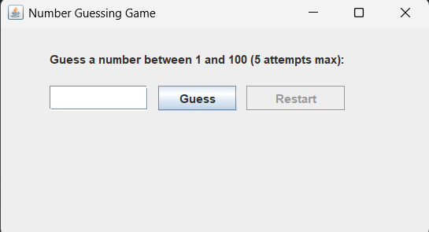

# 🎯 Number Guessing Game

Welcome to the **Number Guessing Game**! 🕹️  
Try to guess a randomly generated number between **1 and 100**. You have **5 attempts**—can you beat the game? 😎  

---

## ✨ Features
- 🎨 Interactive **GUI** using Java Swing  
- 🎲 Random number generation (1-100)  
- 🕵️‍♂️ Provides hints: *“Too High”* ⬆️ / *“Too Low”* ⬇️  
- 🏆 Displays **congratulations message** when you win  
- 💀 Shows **game over message** when attempts run out  
- 🔄 **Restart button** to play again without restarting the program  
- 🔢 Tracks the number of attempts  
- 🖥️ Simple and beginner-friendly GUI design  

---

## 🖼 Screenshots

  

  

---

## 🏃 How to Run
1. Make sure **Java JDK** is installed ✅  
2. Clone the repository:
   ```bash
   git clone https://github.com/Himani52/SCT_SD_2.git

---

## 📜 Game Rules

1. Only **integer numbers between 1 and 100** are valid. 🔢  
2. Maximum **5 attempts** per game. ⏳  
3. After each guess, the game provides hints:  
   - Too High ⬆️  
   - Too Low ⬇️  
4. Win the game by guessing the correct number 🏆  
5. Lose the game if 5 attempts are used without guessing the number 💀  
6. Click **Restart** 🔄 to play again without closing the application

---

## 💻 Technologies Used

- **Java ☕** – Core programming language  
- **Java Swing 🎨** – Graphical User Interface (GUI)  
- **Random Class 🎲** – Generates the random number  
- **Event Handling 🖱️** – Handles button clicks and user interaction  
- **JLabel, JButton, JTextField 📝** – For creating UI components  
